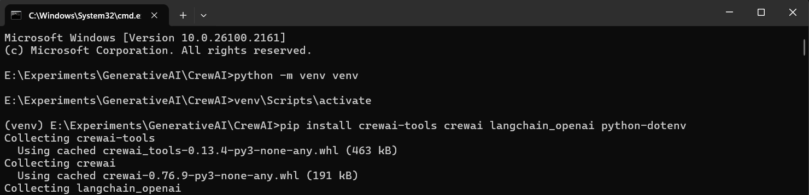
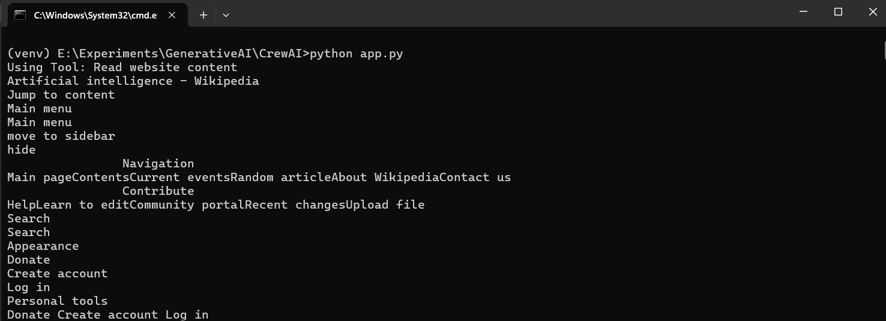
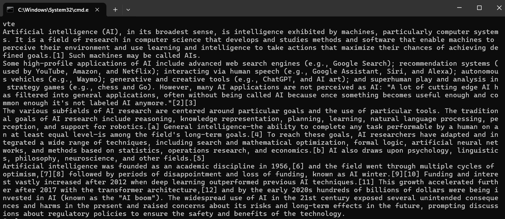
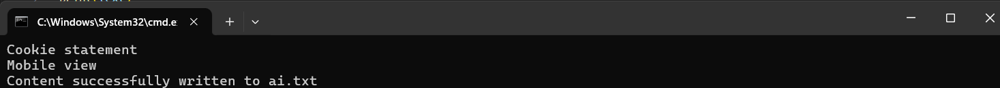
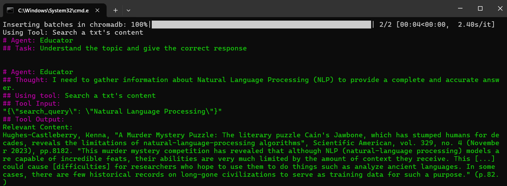
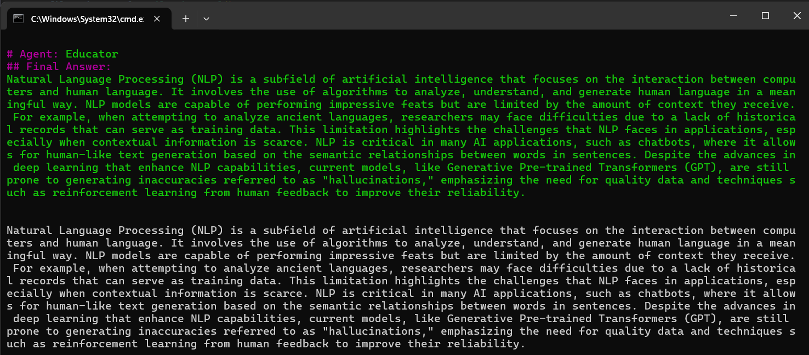
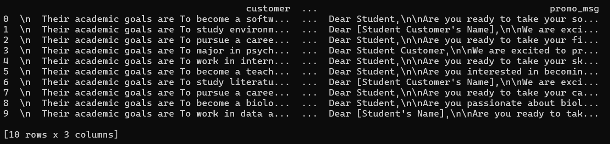
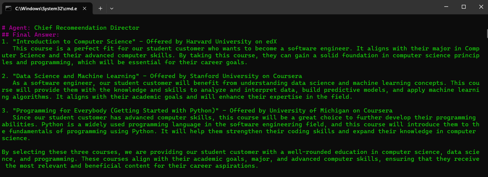
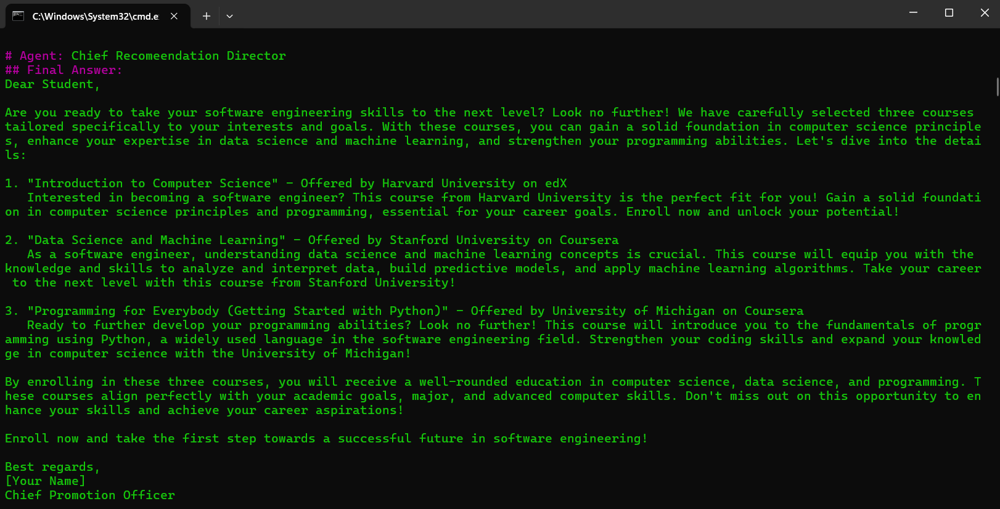
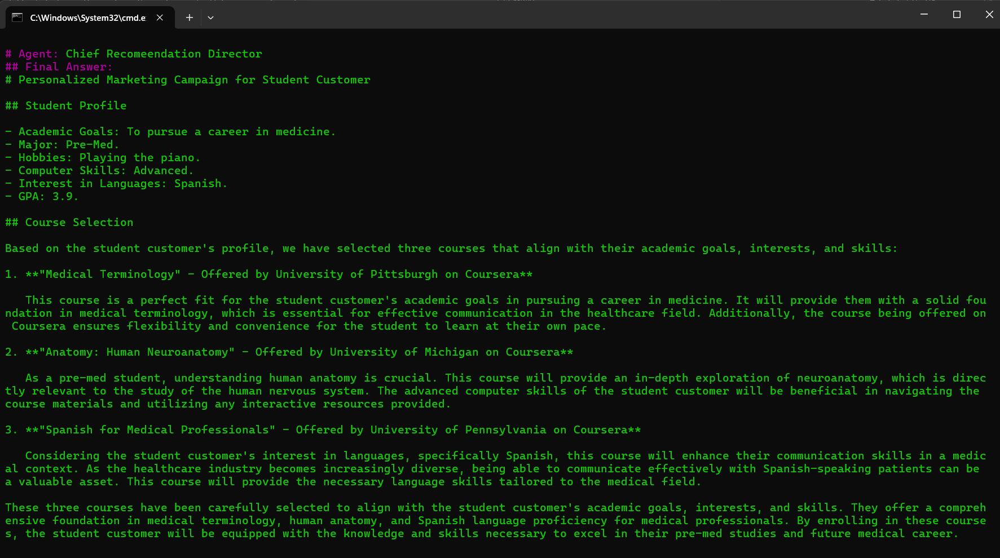

# CrewAI Demo

CrewAI is a Cutting-edge framework for orchestrating role-playing, autonomous AI agents. By fostering collaborative intelligence, CrewAI empowers agents to work together seamlessly, tackling complex tasks.

## Why CrewAI?

The power of AI collaboration has too much to offer.
CrewAI is designed to enable AI agents to assume roles, share goals, and operate in a cohesive unit - much like a well-oiled crew. Whether you're building a smart assistant platform, an automated customer service ensemble, or a multi-agent research team, CrewAI provides the backbone for sophisticated multi-agent interactions.

## Getting Started

To get started with CrewAI, follow these simple steps:

### 1. Installation

Ensure you have Python >=3.10 <=3.13 installed on your system. CrewAI uses [UV](https://docs.astral.sh/uv/) for dependency management and package handling, offering a seamless setup and execution experience.

First, install CrewAI:

```shell
pip install crewai
```

If you want to install the 'crewai' package along with its optional features that include additional tools for agents, you can do so by using the following command:

```shell
pip install 'crewai[tools]'
```
The command above installs the basic package and also adds extra components which require more dependencies to function.


# Screenshots










